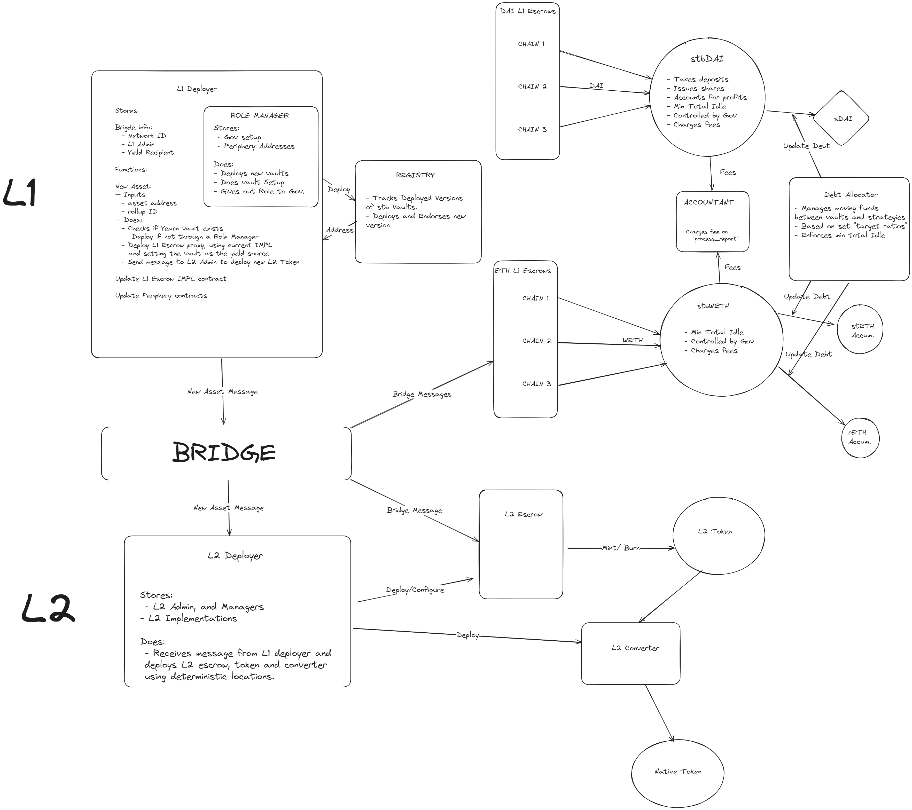

# Yearn Stake the Bridge 

# Structure



## [L1 Deployer](https://github.com/yearn/yearn-stb/blob/master/src/L1Deployer.sol)

- The L1 rollup admin will register their rollup with the L1 Deployer
    - `registerRollup`
        - rollupID
        - L1 EscrowManager
        - L2 Deployer

    - Deploys a new vault if not yet, does full setup. 
    - Deploys L1 escrow and sends message to bridge to L2 escrow.

- Allows anyone to add a new asset to any registered Rollup
    - `newEscrow`
        - rollupID
        - L1 Token

- Allows for a Rollup Admin to add custom vaults for a specific asset.
    - `newCustomVault`
        - rollupID
        - L1 Token
        - Vault (Optional)

- Allows for a Rollup Admin to update is EScrow Manager or L2 Deployer

- Holds all data for deployed vaults and escrows
    - Uses 0 for the default vaults or the rollup specific ID for any custom vaults.
    
- Holds the Role Manager position for all vaults.


## [L2 Deployer](https://github.com/yearn/yearn-stb/blob/master/src/L2Deployer.sol)

- Receives message from L1 Deployer when a new escrow was created for a new asset.
- Deploys L2 Token, Escrow and convertor and completes setup
- Owned by L2 Admin

## [L1 Yearn Escrow](https://github.com/yearn/yearn-stb/blob/master/src/L1YearnEscrow.sol)
- Yearn specific L1 Escrow contract that handles bridge transactions.

- Will deposit funds into a Yearn vault during a bridge if amounts are over any set `minimumBuffer`

- If withdraws cannot be processed it will send shares to users when bridging back to L1.

- Rollups Admin can update the `minimumBuffer` as well as the vault it uses.

- Allows for permissionless rebalance's based on the `minimumBuffer`.

## Foundry Documentation

https://book.getfoundry.sh/

## Usage

### Build

```shell
$ make build
```

### Test

```shell
$ make tests
```

### Trace

```shell
$ make trace
```

### Gas Snapshots

```shell
$ make snapshot
```

### Cast

```shell
$ cast <subcommand>
```

### Help

```shell
$ forge --help
$ anvil --help
$ cast --help
```
