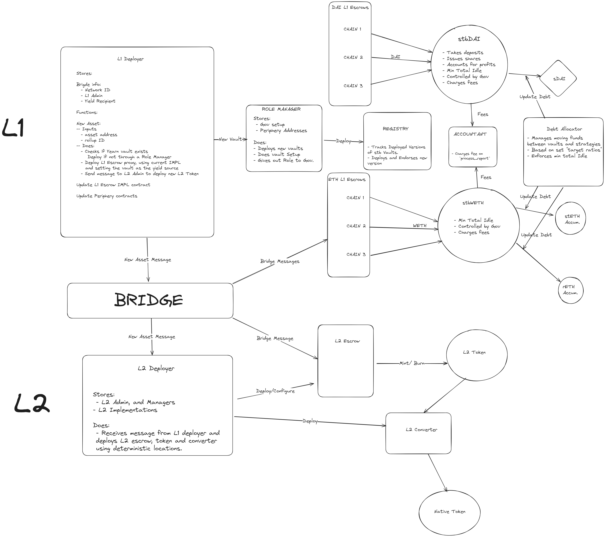

# Yearn Stake the Bridge 

# Structure



## [Role Manager](https://github.com/yearn/yearn-stb/blob/seperate/src/RoleManager.sol)

- Yearn governed contract to handle vault deployments and configuration

## [L1 Deployer](https://github.com/yearn/yearn-stb/blob/master/src/L1Deployer.sol)

- The L1 rollup admin will register their rollup with the L1 Deployer
    - `registerRollup`
        - rollupID
        - L1 EscrowManager
        - L2 Deployer

    - Deploys a new vault if not yet, does full setup. 
    - Deploys L1 escrow and sends message to bridge to L2 escrow.

- Allows anyone to add a new asset to any registered Rollup
    - `newEscrow`
        - rollupID
        - L1 Token

- Allows for a Rollup Admin to add custom vaults for a specific asset.
    - `newCustomVault`
        - rollupID
        - L1 Token
        - Vault (Optional)

- Allows for a Rollup Admin to update is EScrow Manager or L2 Deployer


## [L2 Deployer](https://github.com/yearn/yearn-stb/blob/master/src/L2Deployer.sol)

- Receives message from L1 Deployer when a new escrow was created for a new asset.
- Deploys L2 Token, Escrow and convertor and completes setup
- Owned by L2 Admin

## [L1 Yearn Escrow](https://github.com/yearn/yearn-stb/blob/master/src/L1YearnEscrow.sol)
- Yearn specific L1 Escrow contract that handles bridge transactions.

- Will deposit funds into a Yearn vault during a bridge if amounts are over any set `minimumBuffer`

- If withdraws cannot be processed it will send shares to users when bridging back to L1.

- Rollups Admin can update the `minimumBuffer` as well as the vault it uses.

- Allows for permissionless rebalance's based on the `minimumBuffer`.


# Deployments


**L1 Deployer**: `0x`
**STB Role Manager**: `0x`


In order to integrate your Polygon CDK chain with STB you will need to 

1. Deploy an `L2Deployer` on your rollup.
2. Register the rollup and the L2 Deployer address with the L1 Deployer.

Once done it is permsissionless for anyone to use the STB to bridge from mainnet to your rollup.

There is a pre-built [script](https://github.com/yearn/yearn-stb/blob/master/scripts/RegisterRollup.s.sol) that can be run from this repo in order to complete the full setup.

**NOTE**: The script assumes the rollups `admin` on the L1 is a Gnosis Safe and the private key input maps to either a singer or a delegate of that safe in order to post the txn that registers the rollup.

```shell
$ git clone --recursive https://github.com/yearn/yearn-stb

$ cd yearn-stb

$ cp .env.example .env
```

Fill in the ful .env with your specific rollup RPC, Polygon CDK based rollup ID, and the desired addresses. 

**NOTE**: To deploy a L2 Deployer during the script leave the `L2_DEPLOYER` variable as address(0). If one is already deployed, insert the address in that variable to not re-deploy.

If you have not added a keystore private key to foundry before add your address to use

```shell
$ cast wallet import --interactive <wallet_name>
```

Run the script
```shell
$ make register account=<wallet_name> sender=<wallet_address>
```

If successful the txn will both deploy the L2 Deployer on the specified rollup and post a Safe txn to register the Rollup in the L1 Deployer.


### Verification

The L2 Deployer will deploy 3 other implementation contracts with it when deployed.

You can find the flatten version of all contracts deployed on the L2 in the repo https://github.com/yearn/yearn-stb/tree/master/flat

The encoded constructor arguments used for the L2 deployer should be logged in the console on deployment as well.

## Foundry Documentation

https://book.getfoundry.sh/

## Usage

### Build

```shell
$ make build
```

### Test

```shell
$ make tests
```

### Trace

```shell
$ make trace
```

### Gas Snapshots

```shell
$ make snapshot
```

### Cast

```shell
$ cast <subcommand>
```

### Help

```shell
$ forge --help
$ anvil --help
$ cast --help
```
